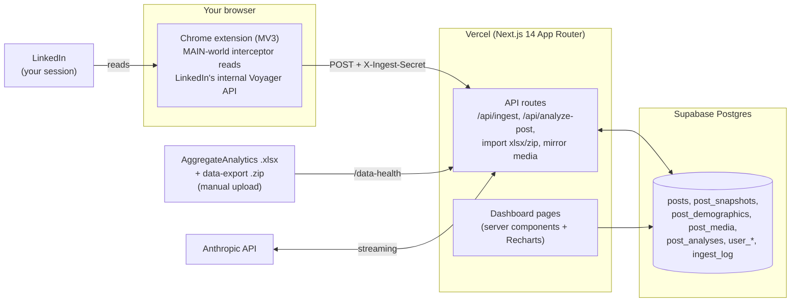

# LinkedIn Analytics Command Center

> A self-hosted LinkedIn analytics dashboard — own your data instead of renting
> it from Shield, Taplio, or Kleo. Next.js + Supabase + a browser extension that
> captures analytics from *your own* LinkedIn session.

[](./LICENSE)

Third-party LinkedIn analytics tools charge $8–149/mo for what is fundamentally
*your own data*. This project is a free, self-hosted alternative: it runs on
Vercel's free tier, keeps every byte in a database you control, and goes deeper
than the paid tools — per-post demographic drill-downs, cohort comparisons,
earned-media value, a content checklist, and an AI writing critique of each post.

> [!WARNING]
> **This automates extraction of your own analytics from your own authenticated
> LinkedIn session.** It does not scrape other people and is for personal,
> non-commercial use — but it lives in a Terms-of-Service gray area and can
> break whenever LinkedIn changes its internals. **Read [`SHORTCOMINGS.md`](./SHORTCOMINGS.md)
> before you rely on it** — especially the section on the browser extension,
> which is the most fragile part.

---

## What it does

**Per-post analytics** (the core value)
- Impressions, reach, engagement rate, followers gained, and the full reaction
  breakdown for every post the system can still reach.
- **Percentile ranking** and **cohort comparison** — how a post did vs. your
  other posts that share its topic + format (e.g. "image posts about product").
- A **content checklist / playbook** and **post-vs-post optimization** view.

**Audience & demographics**
- Per-post demographic drill-downs (location, seniority, job title, company,
  industry, company size), plus an aggregate audience view.

**AI enrichment** (optional, needs an Anthropic key)
- **Idea cloud** — topic clustering across all your posts.
- **Per-post writing critique** — streams a structured critique (what worked /
  what to improve / rewrite ideas / lesson) using a writing rubric you control.

**Other surfaces**
- **Earned-media value** (a CPM applied to your impressions), **media mirroring**
  to Vercel Blob, an **activity log**, a **network** view from your connections,
  and a **/data-health** page with freshness tracking + manual import uploaders.

---

## Architecture

Three layers feed one database.



1. **Chrome extension (MV3)** — installs a `fetch`/`XHR` interceptor in the
   LinkedIn page, reads the internal Voyager GraphQL responses (per-post metrics,
   demographics, connection count), and POSTs them to the dashboard's ingest API
   with a shared secret. ⚠️ This is the fragile part — see `SHORTCOMINGS.md`.
2. **Vercel Functions (Next.js 14, App Router)** — ingest, the manual `.xlsx`/
   `.zip` importers, media mirroring, the AI analysis endpoint, and all the
   dashboard pages. Auth is a single shared password + signed cookie; the ingest
   API also accepts the `X-Ingest-Secret` header.
3. **Supabase Postgres** — schema managed with Drizzle ORM + committed
   migrations. Never hand-edit tables in the Supabase UI; change `src/db/schema.ts`
   and generate a migration.

### Tech stack
Next.js 14 · TypeScript · Tailwind CSS 3 · Recharts + TanStack Table ·
Supabase Postgres · Drizzle ORM · Vercel Blob · Anthropic SDK · Vitest.

### Repository layout
| Path | What |
|---|---|
| `src/app/` | Pages (server components) + API routes |
| `src/db/schema.ts` | Drizzle table definitions — source of truth for DB shape |
| `src/lib/` | Data loading, calculations, AI helpers, importers |
| `src/components/charts/` | `'use client'` Recharts wrappers |
| `drizzle/` | Generated, committed migration SQL |
| `scripts/` | Seed, backfill, and maintenance scripts |
| `extension/` | The Chrome MV3 extension (build with `npm run ext:build`) |
| `docs/` | Architecture guide + LinkedIn API reconnaissance notes |
| `PROJECT.md` | Deep design doc + phased roadmap |
| `SHORTCOMINGS.md` | **Honest list of what's fragile / incomplete** |

---

## Documentation

If you're here to build your own LinkedIn analytics tool from this, read in this
order:

1. **This README** — what it is, the architecture, and how to deploy your own.
2. **[`docs/ARCHITECTURE.md`](./docs/ARCHITECTURE.md)** — the builder's guide.
   Describes *everything* in the project (data model, every API route and page,
   the extension internals, the AI features) and ends with a **"Building your
   own from this"** walkthrough. **Start here once the README hooks you.**
3. **[`SHORTCOMINGS.md`](./SHORTCOMINGS.md)** — an honest account of what's
   fragile and incomplete, especially the browser extension. Read before you
   rely on it.
4. **[`docs/voyager-recon.md`](./docs/voyager-recon.md)** — how the extension
   discovers LinkedIn's internal API; useful if you want to harden the parsers.
5. **[`PROJECT.md`](./PROJECT.md)** — the original design doc + phased roadmap
   (historical; the README and architecture guide are the canonical references).

---

## Getting started

### Prerequisites
- Node.js 20+ and npm
- A [Supabase](https://supabase.com) project (free tier is fine)
- A [Vercel](https://vercel.com) account (free tier is fine)
- *(optional)* An [Anthropic API key](https://console.anthropic.com) for the AI features
- Google Chrome (to run the extension)

### 1. Clone & install
```bash
git clone <your-fork-url> linkedin-analytics
cd linkedin-analytics
npm install
```

### 2. Configure environment
```bash
cp .env.example .env.local
# then edit .env.local — see the comments in that file for where each value
# comes from and how to generate the secrets.
```
**Make it yours** (no code edits needed): set `NEXT_PUBLIC_OWNER_NAME` and
`NEXT_PUBLIC_OWNER_TITLE` for the title/login/sidebar, and `ANALYTICS_TIMEZONE`
(an IANA zone like `America/New_York`) so the posting-time insights match your
audience. All are optional — they fall back to neutral defaults. The per-post
AI critique defaults to Brazilian Portuguese; to change its language, edit the
clearly-marked block at the top of `src/lib/analyze-post/prompt.ts`.

### 3. Create the database schema
```bash
npm run db:migrate     # applies the committed migrations in drizzle/
# npm run db:studio    # optional: browse the DB visually
```
A fresh install starts with an **empty database** — it fills up as the
extension ingests data and as you upload the manual exports. (The legacy
`npm run db:seed` expects a personal master JSON that won't exist in a fork;
skip it.)

### 4. Run locally
```bash
npm run dev            # http://localhost:3000
```
Log in with the `DASHBOARD_PASSWORD` you set in `.env.local`.

### 5. Deploy to Vercel
Push your fork to GitHub and import it in Vercel. Add **every variable from
`.env.example`** under Settings → Environment Variables (Production). Vercel
auto-deploys on push.

### 6. Build & load the extension
```bash
npm run ext:build      # outputs extension/dist/
```
Then in Chrome: `chrome://extensions` → enable **Developer mode** → **Load
unpacked** → select `extension/dist/`.

### 7. Configure the extension
Open the extension's **Options** page and set:
- **Ingest URL** — `https://<your-app>.vercel.app/api/ingest` (or `http://localhost:3000/api/ingest` for local testing)
- **Ingest secret** — the exact `INGEST_SECRET` value from your env

> If you deploy to a **custom domain** (not `*.vercel.app`), add it to
> `host_permissions` in `extension/public/manifest.json` and rebuild.

Then browse to your LinkedIn analytics pages with a logged-in session; the
extension captures in the background and POSTs to your dashboard. Check
`/data-health` to confirm data is flowing and to upload the manual exports.

---

## How data flows in
| Source | Refresh | Populates |
|---|---|---|
| Browser extension (automatic) | Daily, while you browse LinkedIn | Per-post metrics, demographics, follower/connection counts |
| AggregateAnalytics `.xlsx` (manual upload at `/data-health`) | ~Every 45 days | Daily engagement, profile demographics |
| "Get a copy of your data" `.zip` (manual upload) | When you request an archive | Your comments / reactions / connections on others' posts |

---

## Known limitations
This is a working personal project, not a polished product. **Please read
[`SHORTCOMINGS.md`](./SHORTCOMINGS.md)** — it's an honest, detailed account of
what's fragile (the extension especially), what requires manual work, the data
accuracy caveats, and the Terms-of-Service gray area. Don't skip it.

---

## Contributing
Issues and PRs welcome — the most valuable contributions are around making the
extension more resilient (see the "If you want to make it robust" list in
`SHORTCOMINGS.md`). Schema changes go through Drizzle: edit `src/db/schema.ts`,
run `npm run db:generate`, commit the generated SQL.

## License
[MIT](./LICENSE) © 2026 Pedro Ripper
